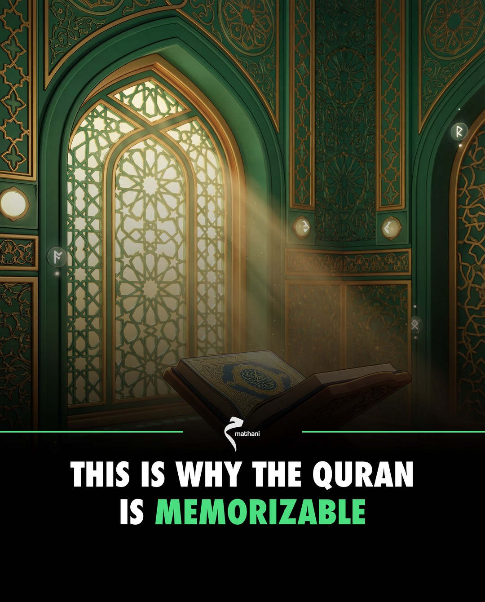
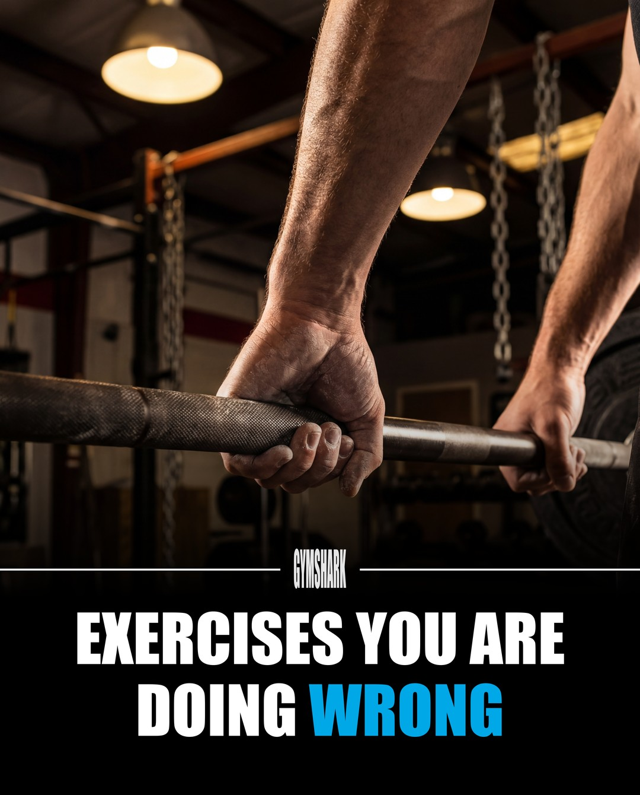

# brandslide

Turn any brand into professional Instagram carousels using Claude Code.

AI generates cinematic scenes. Code handles typography. Every slide is pixel-perfect and on-brand.

<p align="center">
  
  
  
</p>

---

## What This Is

brandslide is a content production platform that runs inside Claude Code. You give it a brand, it produces Instagram carousels — fully researched, scripted, designed, and captioned.

It works by splitting the job between AI and code:
- **NanoBanana** (AI image generation) creates cinematic scene images — no text, no gradient, just the visual
- **shared/core.py** (Python compositor) layers on all the brand elements programmatically — gradient, headline, accent coloring, subtext, logo

This solves the core problem: AI can't render the same font consistently across slides. By compositing text with real font files, every slide in a carousel looks identical.

Each brand you create gets two config files:
- **`brand.json`** — What it looks like. Colors, fonts, layout margins, gradient strength, logo placement, scene style prompts. See [full reference](docs/brand-config-reference.md).
- **`CLAUDE.md`** — What it sounds like. Content pillars, voice and tone, research rules, caption template, content ideas.

---

## Requirements

- macOS (uses system fonts: Impact, Helvetica Neue)
- Python 3.10+
- [Claude Code](https://docs.anthropic.com/en/docs/claude-code)
- NanoBanana MCP server (for AI scene generation)

`/setup` installs Python dependencies automatically on first run.

---

## Getting Started

```bash
git clone https://github.com/imaadmalikkk/brandslide.git
cd brandslide
```

Open in Claude Code. That's your interface for everything from here.

---

## The Workflow

There are 4 commands. You use them in this order:

### 1. `/setup [brand-name]` — Create your brand

```
/setup my-brand
```

This is where you start. Give it a brand name plus a website URL or codebase path (or both). It handles everything:

**Phase 0 (automatic):** Installs Python dependencies, checks fonts exist, copies Claude Code permissions, verifies NanoBanana works.

**Phase 1 — Visual extraction:** Crawls the website or scans the codebase. Extracts colors, fonts, and logo. Presents what it found. You confirm or adjust.

**Phase 2 — Voice extraction:** Reads the website copy, about page, social bios. Infers brand position, tone, target audience, and content pillars. Presents a proposed content strategy. You confirm or adjust.

**Phase 3 — Generation:** Creates the brand folder with `brand.json`, `CLAUDE.md`, `compose_slide.py`, and logo. Validates everything works (fonts load, colors parse, logo renders). Generates 3 test slides — a hook, a content slide, and a closer — so you can see your brand in action. You approve or request changes.

**Output:** A complete brand folder at `brands/my-brand/` ready for content production.

---

### 2. `/tune [brand]` — Refine the visual look

```
/tune my-brand
```

Optional but recommended after `/setup`. This is for dialing in the visual parameters until the slides look exactly right.

Pick a parameter category to tune:
- **Gradient** — how far it fades into the scene, how dark it gets
- **Typography** — headline size, subtext size, line spacing
- **Margins** — space from edges, gap between headline and subtext
- **Logo** — size, opacity, padding from edges
- **Colors** — accent, subtext primary/secondary, divider line
- **Advanced** — scrim overlay, text shadow

For each parameter, `/tune` generates **3 side-by-side variations** of the same slide (e.g., gradient at 180, 220, and 255 opacity). You pick the winner. It updates `brand.json` and moves to the next parameter. Repeat until the look is locked.

All tuning composites at 1080px for speed. When you're done, it can bake a final 4K verification set.

---

### 3. `/ideate [brand]` — Brainstorm content ideas

```
/ideate my-brand
```

Run this when you need carousel ideas. It:

1. Reads your brand's content strategy (pillars, audience, voice)
2. Checks what carousels you've already produced (avoids duplicates)
3. Searches for trending topics in your brand's niche
4. Presents **5 ranked carousel ideas**, each with:
   - Which content pillar it fits
   - Why it would perform well (saves, shares, follows)
   - Suggested hook headline
   - Estimated slide count

Pick 1–3 to produce. You can jump straight into `/generate` from here.

You can also filter by pillar: `/ideate my-brand nutrition`

---

### 4. `/generate [brand] "topic"` — Produce a carousel

```
/generate my-brand "exercises you're doing wrong"
```

This is the full production pipeline. It runs mostly autonomously with one confirmation checkpoint:

1. **Load brand config** — reads `brand.json` + `CLAUDE.md`
2. **Research** — 5–7 web searches on the topic, following whatever accuracy rules your brand defines (e.g., cite scientific studies for fitness brands, verify hadith for Islamic brands)
3. **Script** — writes every slide: headlines, accent words, subtext, and detailed scene descriptions
4. **You confirm the script** — this is the one checkpoint. Review headlines, subtext, and scene ideas. Approve or adjust.
5. **Scene generation** — NanoBanana generates all scenes in parallel at 4K (scene-only, no text)
6. **Compositing** — `compose_slide.py` layers gradient, headline, accent coloring, subtext, and logo onto each scene
7. **Instagram export** — resizes 4K PNGs to 1080x1350 JPEGs ready for upload
8. **Cleanup** — deletes NanoBanana thumbnails
9. **QA** — shows you the hook, 2 content slides, and closer for final review
10. **Caption** — writes the Instagram caption following your brand's template with hashtags

**Output:**
```
brands/my-brand/output/exercises-youre-doing-wrong/
├── scenes/       # Raw AI scenes (4K PNG)
├── 1.png–7.png   # Composited final slides (4K PNG)
├── carousel.json # Compositor config
├── caption.txt   # Instagram caption
└── export/       # Instagram-ready (1080px JPEG)
```

---

## Example Brand

The repo includes a fully configured **Gymshark** example at `brands/gymshark/` with:
- Complete `brand.json` (all visual parameters)
- Complete `CLAUDE.md` (fitness content strategy, 5 pillars, caption template)
- 3 bundled 4K test scenes (gym equipment, supplements, gym interior)
- 3 composited demo slides (hook, content, closer)

You can use this to test compositing immediately, or as a reference when building your own brand.

---

## Project Structure

```
brandslide/
├── shared/
│   ├── core.py                     # Compositing engine — all brands share this
│   └── templates/
│       └── compose_template.py     # Template for new brand scripts
├── brands/
│   └── gymshark/                   # Example brand (your brands go here)
│       ├── brand.json              # Visual config (colors, fonts, layout)
│       ├── CLAUDE.md               # Content strategy (pillars, voice, rules)
│       ├── compose_slide.py        # Thin wrapper that imports core.py
│       ├── logo.png                # Brand logo (white on transparent)
│       ├── scenes/                 # Bundled test scenes
│       └── output/                 # Generated carousels
├── .claude/
│   ├── settings.example.json       # Reference permissions (copied by /setup)
│   └── skills/
│       ├── setup/SKILL.md          # /setup command
│       ├── tune/SKILL.md           # /tune command
│       ├── ideate/SKILL.md         # /ideate command
│       └── generate/SKILL.md       # /generate command
└── docs/
    ├── brand-config-reference.md   # Every brand.json field documented
    └── screenshots/                # Sample output for this README
```
